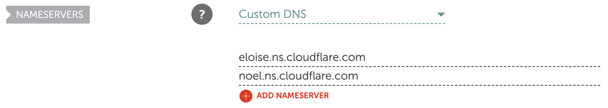
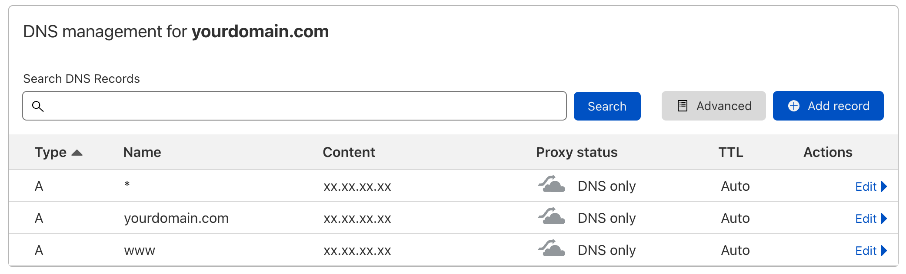

<<<<<<< HEAD
=======
<style>body {text-align: justify}</style>

>>>>>>> 4b37bce (guide almost complete)
# Guide to setup CapRover

_In this guide you will find out how to host CapRover, an open-source app/database deployment and server manager for your NodeJS, Python, PHP, ASP<no-link>.NET, Ruby, MySQL, MongoDB, Postgres, WordPress applications!_

### Prerequisites

To keep up with this tutorial and setup CapRover properly, you need to meet the following prerequisites:

1. Have an active machine running **Ubuntu Live Server**, either on-cloud or on-premise, preferably running version **Bionic 18.04 (LTS)** so that each terminal command mentioned in this guide executes as expected.
2. Have purchased a domain name, since CapRover is (almost) useless without one.

<br>

## Docker Engine installation

Login to your virtual machine using your preferred method and check if you have the **Docker Engine** already installed, by executing the following command on the terminal. If the output you get is similar to the one below, you are good to go and you can skip this chapter.

```bash
foo@bar:~$ docker --version
Docker version xx.xx.xx, build xxxxxxx
```

If the **Docker Engine** is not installed, the above-mentioned command will output the message below. In this case, follow the steps below to install the necessary packages properly.

```bash
foo@bar:~$ docker --version
docker: command not found
```

### Steps

1.  In case you had installed **Docker Engine** in the past but you are unsure whether it is setup properly, or you just want to do a fresh install, you can uninstall any old installations using the following command. Be aware that if it is not installed the terminal will output that these packages either do not exist or that they are not installed. That's okay.

    ```bash
    # if any of the following packages is installed it will be uninstalled completely.
    sudo apt-get remove docker docker-engine docker.io containerd runc
    ```

2.  Check your system for updates and _(preferrably)_ upgrade each package to its latest version so you can smoothly keep up with this guide without unnecessary errors. This can be done by executing the following terminal commands with **_(sudo)_** administrative rights.

    ```bash
    # check for updates and upgrade to latest version. '-y' flag accepts any T&C that might occur.
    $ sudo apt-get update && sudo apt-get upgrade -y
    ```

    After the last command has finished executing, hopefully without any errors, your system packages are updated to their latest version and we are good to move to the next step.

3.  For **Docker Engine** to function properly, some necessary packages need to be installed to the system. To install the needed packages, you can execute the following command in the terminal.

    ```bash
    sudo apt-get install ca-certificates curl gnupg lsb-release
    ```

4.  Next on, we need to add Docker's official GPG ([GNU Privacy Guard](https://en.wikipedia.org/wiki/GNU_PG)) key to the machine to ensure that we get the official releases of the **Docker Engine** safely.

    ```bash
    # create directory to store the GPG key
    sudo mkdir -p /etc/apt/keyrings
    # download the GPG key using curl
    curl -fsSL https://download.docker.com/linux/ubuntu/gpg | sudo gpg --dearmor -o /etc/apt/keyrings/docker.gpg
    ```

5.  Now, we need to setup the repository of **Docker Engine** so, that, it is added to the package index of our system, in order for us to be able to download the **Docker Engine** using `apt-get`. This can be done by executing the command below.

    ```bash
    echo \
    "deb [arch=$(dpkg --print-architecture) signed-by=/etc/apt/keyrings/docker.gpg] https://download.docker.com/linux/ubuntu \
    $(lsb_release -cs) stable" | sudo tee /etc/apt/sources.list.d/docker.list > /dev/null
    ```

6.  At this point, we are almost ready to install **Docker Engine**. Before that though, we need to update the package index so that is sees **Docker's** repository we setup in the previous steps. This can be easily done with the following command.

    ```bash
    sudo apt-get update
    ```

7.  We are now finally ready to install the **Docker Engine** and some packages that it requires alongside it. Fingers crossed, this can be done by executing the command below.

    ```bash
    sudo apt-get install docker-ce docker-ce-cli containerd.io docker-compose-plugin
    ```

8.  Now that we are finally done, it's time to test if the **Docker Engine** works as expected without any issues. To do that, we will launch a Docker container ([this one](https://hub.docker.com/_/hello-world)) provided officialy by Docker, that will ensure if everything is setup as expected. To get and launch the 'hello-world' container, you can execute the following command.

    ```bash
    sudo docker run hello-world
    ```

    Assuming everything is setup & functioning properly and as expected you should get the following output. If not, repeat the **Docker Engine** installation guide carefully. If, still, the issue persists, it's a great chance for you to practice your web scraping skills and search for a solution to your problem.

    ```bash
    Hello from Docker!

    This message shows that your installation appears to be working correctly.

    To generate this message, Docker took the following steps:

    1.  The Docker client contacted the Docker daemon.
    2.  The Docker daemon pulled the "hello-world" image from the Docker Hub. (amd64)
    3.  The Docker daemon created a new container from that image which runs the executable that produces the output you are currently reading.
    4.  The Docker daemon streamed that output to the Docker client, which sent it to your terminal.

    To try something more ambitious, you can run an Ubuntu container with: $ docker run -it ubuntu bash

    Share images, automate workflows, and more with a free Docker ID: https://hub.docker.com/

    For more examples and ideas, visit: https://docs.docker.com/get-started/
    ```

    <br>

## CapRover installation

Assuming you either followed the guide above to install the **Docker Engine** or you already had the **Docker Engine** installed on your (virtual) machine, it now time to start dealing with **CapRover**.

First, let's verify that Docker is running correctly on your system by executing the following command. If it outputs the version that is currently installed in your system we are good to go, else, you need to revisit the guide above and install the **Docker Engine** properly.

```bash
foo@bar:~$ docker --version
Docker version xx.xx.xx, build xxxxxxx
```

Then, again, before we proceed, you need to make sure that you have configured the DNS settings on your domain name properly and that the A records pointing to your machine's IP address are properly configured.

For this guide's sake, as an example, the domain used for testing is purchased from [Namecheap](namecheap.com) and the DNS handling is transferred over to [Cloudflare](cloudflare.com), as it's easier & simpler to manage the DNS settings from Cloudflare's control panel. This is clearly a preference of mine and should not be taken as an advice. However, on Namecheap's control panel, I have set the "Nameservers" option to "Custom DNS" and then configured them according to the instructions of Cloudflare.



Then, over on **Cloudflare's** control panel, the DNS settings for everything to function properly are the following. The **IP address** of the server is replaced by **xx.xx.xx.xx** for obvious security reasons. Also, for this guide's simplicity, the proxy service offered by Cloudflare is disabled as you can see on the **"Proxy status"** column.



Now, let's (finally) move on to install and configure **CapRover** on our machine.

### Steps

1. In order for **CapRover** to work properly we need to allow some ports on our firewall if one is active. It is generally suggested that the firewall is always active, and in this case it is. To allow incoming/outgoing traffic on the ports needed for CapRover to operate as expected you can execute the following command, with **(sudo)** administrative rights.

   ```bash
   sudo ufw allow 80,443,3000,996,7946,4789,2377/tcp; ufw allow 7946,4789,2377/udp;
   ```

   If you want to further investigate why these ports need to be allowed on the firewall rules and what their purpose is, click [here](https://caprover.com/docs/firewall.html) for more information on CapRover's official documentation website.

2. Now that our firewall rules are configured correctly, let's deploy a Docker container that will launch **CapRover** on our machine.

   ```bash
   docker run -p 80:80 -p 443:443 -p 3000:3000 -v /var/run/docker.sock:/var/run/docker.sock -v /captain:/captain caprover/caprover
   ```

3. Assuming that there were not any errors during the container's deployment, let's now move on and install the CapRover CLI in order to configure our CapRover instance. To perform this action, Node.js runtime and NPM package manager need to be installed in our system.

   If you do not have Node.js runtime and NPM package manager installed in your system, you can install them with the command below. If you already have them installed, you can skip the following command.

   ```bash
   sudo apt-get install nodejs npm
   ```

   Once the installation is complete, you can now install the **CapRover CLI** in your system by executing the following command.

   ```bash
   npm install -g caprover
   ```

4. Finally, now it's time to configure our **CapRover** instance. To do this, you can execute the following command and enter your server's IP address, your domain name in this strict format, without **www** or anything else, "**yourdomain.com**" (without the double quotes). You will also be asked to configure an administrator's password. This password will be used by you to login to the web interface of **CapRover**, so be sure you remember it.

   ```bash
   caprover serversetup
   ```
