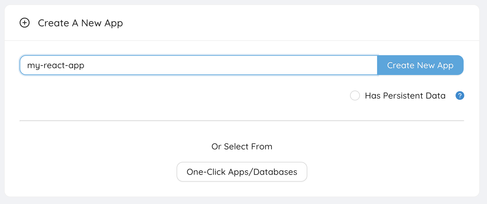
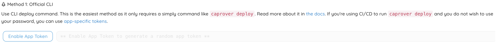
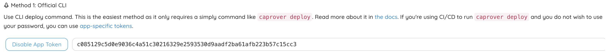

# Guide to deploy a React app using CapRover

_In this guide, you will find out how to deploy a React app using CapRover, an open-source PasS, and continuously deliver changes in your codebase to your app deployment on CapRover every time you push a commit to your Github repository (codebase). To follow up with this guide, you need to have CapRover up and running. Visit this guide to learn how to do that._

To showcase that, we will create a sample React app using the default template provided by the React team.

Open up an IDE of your choice, in this guide we will be using Visual Studio Code, launch the integrated terminal and execute the following command to create a boilerplate React app.

```bash
npx create-react-app . # this will create the React application's source files on the current working directory
```

After that, we need to create a file called `captain-definition` (without any extension), that will contain the needed data for CapRover to build and deploy our React app.

Open the file we just created, paste the content below inside it and save it.

```json
{
  "schemaVersion": 2,
  "dockerfileLines": [
    "FROM socialengine/nginx-spa:latest",
    "COPY ./build /app",
    "RUN chmod -R 777 /app"
  ]
}
```

To put it simply, this file instructs CapRover, once a build event is triggered, to launch a Docker container with an **nginx** web server configured for a SPA (Single Page Application), such as a built React app, then copy everything from the temporary folder named `build` that the Github Action, that we will setup below, generates, to the folder `app` which is about to contain the static files _(html, css, js)_, that the **nginx** web server will serve to our clients and finally run our app.

Now, let's move on and create an empty app on our CapRover dashboard.

1. Visit your CapRover instance's dashboard, login and create a new app with a name of your choice (e.g. **my-react-app**) as seen below.

   

2. Click on the name of your app in the list below to go to the app's settings page and then go to the "Deployment" tab and scroll down until you see this.

   

   Once you are there click on the "Enable App Token" button and a token will be generated as the example below. Click inside the field to copy the token to the clipboard.

   

Next, let's move over to Github to create and configure a Github Action that will each time a `git push` event is detected, will build our React app, bundle it together with `captain-definition` file into a tarball and serve it to our CapRover instance to deploy it.

1. Visit your repository on Github and go to the "**Actions**" tab. There below the "**Get started with GitHub Actions**", you will see a link saying **"Skip this and set up a workflow yourself"** as seen below.

2. Once you click the link, you will be redirected to a page to create a workflow file (with the extension `.yml`) that will contain all the needed information for the whole build & deploy procedure. In the upper-left section above the text editor you will the a field with the filename inside it. By default, the file would be called `main.yml` but we need to change it to `deploy.yml` in order for everything to function properly. After you do so, paste the contents below inside the text editor and click the green **Start commit** button on the upper-right section, and then click the green **Commit new file** button to save the workflow `.yml` file.

   ```yml
   name: Build & Deploy

   on:
     push:
       branches: ["master"]

     pull_request:
       branches: ["master"]

   jobs:
     build-and-deploy:
       runs-on: ubuntu-latest
       strategy:
         matrix:
           node-version: [18.x]

       steps:
         - name: Setting up Github Actions...
           uses: actions/checkout@v3

         - name: Setting up Node environment...
           uses: actions/setup-node@v2
           with:
             node-version: ${{ matrix.node-version }}

         - name: Building React app...
           run: |
             npm ci
             npm run build --if-present

         - name: Packaging build to a tarball...
           uses: a7ul/tar-action@v1.1.0
           with:
             command: c
             cwd: "./"
             files: |
               captain-definition
               build/
             outPath: deploy.tar

         - name: Deploying app to CapRover...
           uses: caprover/deploy-from-github@v1.0.1
           with:
             server: "${{ secrets.CAPROVER_SERVER }}"
             app: "${{ secrets.APP_NAME }}"
             token: "${{ secrets.APP_TOKEN }}"
   ```

3. Once the workflow mentioned above is succesfully created moving on to **Settings** tab of your repository and from within the **Security** group on the sidebar, click on the **Secrets** option and once the dropdown menu expands, click the option named **Actions**. There you will need to create 3 new secrets as shown below.

   - **APP_TOKEN** that should contain the token we generated and copied to our clipboard earlier on this guide,
   - **APP_NAME** that should contain the name of your CapRover application exactly as you typed it in the beginning, and lastly,
   - **CAPROVER_SERVER** that should contain the address of your CapRover instance, strictly in this format `https://captain.yourdomain.com` (only change the `yourdomain.com` part)

4. If you followed each step of this guide carefully, our app is ready to be deployed to the web! Go to your IDE and push the source files into your Github repository and after a few moments, your app will ready in production mode & SSL-enabled in a URL of this format `https://my-react-app.yourdomain.com` (replace `my-react-app` with the app name you chose earlier & `yourdomain.com` with your domain) and see the magic happen!
